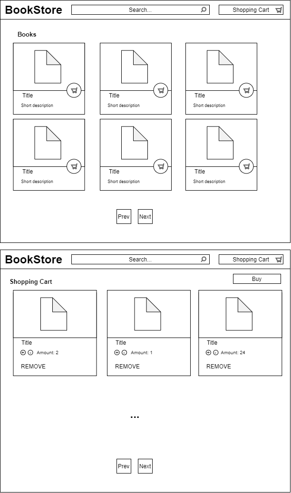
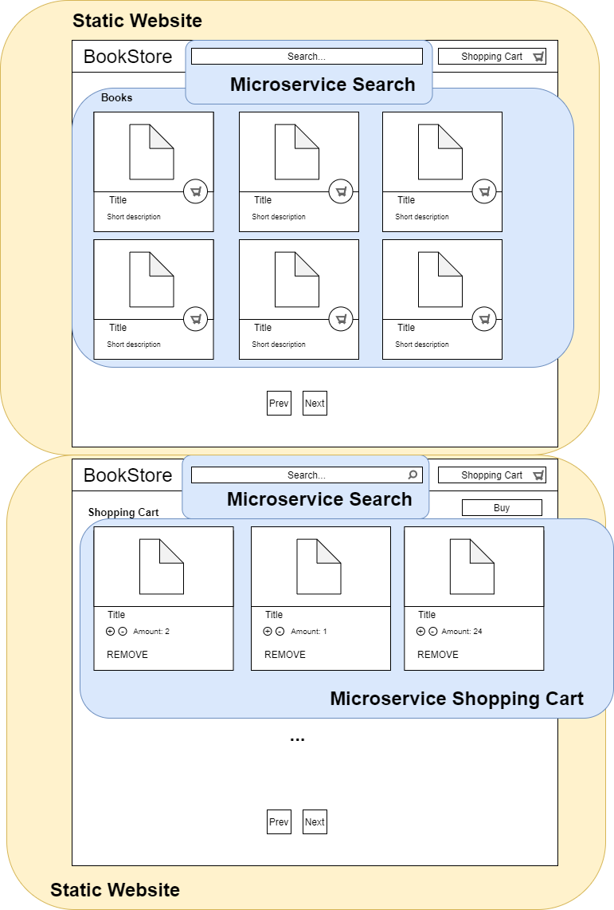
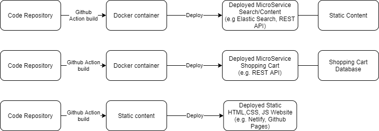

# Cloud Computing Group2

Our project deals with breaking up a traditional monolith, a bookstore web application, into multiple independent microservices
using Docker containers. For this, we additionally set up CI build and deployment of the microservices using Github Actions. 

## Team Members
* Christoph Burghuber
* Markus Unterdechler
* Lukas Wais

## Details

A traditional book store application may look like the mockup seen below. 

We take this application and split it into multiple microservices:

* Microservice Search (Docker container) - Processes search requests, paging and book data.
* Microservice Shopping Cart (Docker container) - Processes the contents of shopping carts 
* Static Website (HTML, CSS, JS) - Contains the static content which dynamically loads data from the microservices if available.

Eventually, the application works like that:

### Deployment

The build and deployment of the microservices will be automated using a simple Git flow with GitHub Actions.

### Workload

In order to make use of our separation into independent microservices, we additionally split up the development of
each microservice into teams. This means each team member listed above is responsible for a single microservice and simulates
an independent development team. Therefore, it might be the case, that the microservices are even developed in different 
programming languages or use different tools.

### Programming Languages

* Java (Microservice)
* .NET C# (Microservice)
* Typescript (Frontend)

### Container Orchestration

* Kubernetes

### Communication

* The containers and the frontend communicate with each other using REST, HTTP(s).

### Monolith

* The source code of the monolith is not available as our idea of the application 
is entirely concept based. This means we assume that the monolith application is an unmaintainable mess which requires
single features to be extracted and moved to the cloud. In detail the application consists out of a PHP project
which violates every kind of separations of concerns possible and comes without tests. An example would be a .php file
containing some part of the presentation layer in HTML, some business logic validations and even database transactions. 
