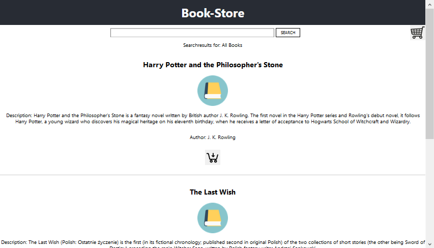
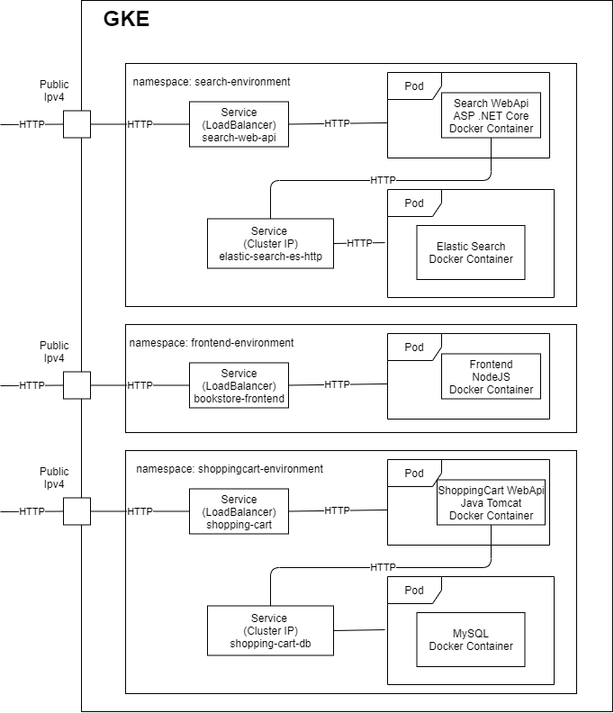

# Cloud Computing Group2

## Team Members
* Christoph Burghuber
* Markus Unterdechler
* Lukas Wais

# Bookstore

## Overview

The aim of this project was to automate the entire process from source-code change to GoogleCloud deployment. Essentially,
we have worked with almost all of the mentioned topics from the lecture: Docker, Kubernetes, CI (Github Actions).

For this, we have developed a web application called bookstore where you can search for books and add them into your
shopping cart. This is a simplified version of a real bookstore as this is not a programming lecture, so we instead focused on the things we have learned during the lecture.


*Screenshot of the BookStore Frontend*

For this we have split up such a simple bookstore application into 3 MicroServices:

* Frontend
* Book Search
* Shopping Cart

These applications were individually developed by different simulated "teams" where each team used different technologies:

* Frontend: React, NodeJS
* Book Search: ASP.NET Core C#, Elastic Search
* Shopping Cart: Tomcat Java, MySQL

In the end the final workload of each team member involved performing the following steps:

* Develop their own microservice using a different programming language together with Docker
* Create yaml files to deploy it into Kubernetes
* Create Github Actions workflow file to only build their own microservice on push
* Deploy their Kubernetes namespace into Google Kubernetes engine
* Update Github Actions for Continuous Deployment on push

Eventually, the deployed application looks like this:



*The final application deployed into Google Kubernetes engine*

## Microservice Frontend

The frontend is implemented in React.
This minimalized implementation of a web-shop-page contains a search-field a book list and a shopping cart. Books can be added to the shopping cart by pressing a button. The shopping cart contains a list of books that have been added and a remove button.


### Docker image

The dockerfile for building up the docker image basically copies the needed code, installs needed Node.js and react-scrips and starts the application with 'npm starts'.

```console
FROM node:13.12.0-alpine

WORKDIR /app
ENV PATH /app/node_modules/.bin:$PATH

COPY package.json ./
COPY package-lock.json ./
RUN npm install --silent
RUN npm install react-scripts@3.4.1 -g --silent

COPY . ./
CMD ["npm", "start"]
```

### Google Cloud

For the frontend microservice a Deployment and a Service are created.

The Deployment takes care that the image is always available. We use 'replicas: 2' and 'type: RollingUpdate' to have at least one available pod at each time when doing a rollup update.

```console
...
spec:
  replicas: 2
  selector:
    matchLabels:
      app: bookstore-frontend
  strategy:
    type: RollingUpdate
    rollingUpdate:
      maxSurge: 1
      maxUnavailable: 1
...
```

It is also defined that the Deployment should provide the docker image 'cloudcompdocker/bookstore-frontend:latest' and that this image should be pulled even if docker-tag not changed with 'imagePullPolicy: Always'. (cause in this project it is always :latest)

```console
...
      containers:
      - name: bookstore-frontend
        image: cloudcompdocker/bookstore-frontend:latest
        imagePullPolicy: Always
...
```

The Service provides a fixed access point for the service. Since the Service should be reachable from outside a 'LoadBalancer' is used. The external port 80 (HTTP) is forwarded to internal port 3000.

```console
...
spec:
  ports:
  - port: 80
    protocol: TCP
    targetPort: 3000
  selector:
    app: bookstore-frontend
  type: LoadBalancer
```

### GitHub Actions

The .github\workflows\frontend.yml contains the configuration for the frontend github actions.

First we define the event that automatically triggers the GitHub-Actions. In this case after every 'push' request inside of the frontend-bookstore folder.

```console
name: frontend_CICD

on:
  workflow_dispatch:
  push:
    paths:
    - 'frontend-bookstore/**'
...
```

At next we define the jobs which should be executed. 'runs-on: ubuntu-latest' means that the jobs are executed on a fresh virtual machine hosted by GitHub. All jobs are listed under 'steps'.

```console
...

jobs:
  path-context:
    runs-on: ubuntu-latest
    steps:

...
```

The first job is to checkout the code.

```console
...
    -
        name: Checkout
        uses: actions/checkout@v2
...
```

At next we build the docker image, login to docker hub and push the created docker image. The docker image is called 'cloudcompdocker/bookstore-frontend'.

```console
...
      -
        name: Set up Docker Buildx
        uses: docker/setup-buildx-action@v1
      -
        name: Login to DockerHub
        uses: docker/login-action@v1
        with:
          username: ${{ secrets.DOCKER_USERNAME }}
          password: ${{ secrets.DOCKER_PWD }}
      -
        name: Build and push
        uses: docker/build-push-action@v2
        with:
          context: ./frontend-bookstore/bookstore
          push: true
          tags: cloudcompdocker/bookstore-frontend:latest
...
```

For deploying to google cloud we have first to connect to the corresponding google cloud cluster. For this a service-account-key was created. With service-account-key, project-id, cluster-name and Location it is possible to get a connection to the cluster. After that 'kubectl' can be used for modifications.

```console
...
      - 
        uses: google-github-actions/setup-gcloud@master
        with:
          version: '290.0.1'
          service_account_key: ${{ secrets.GK_KEY }}
          project_id: ${{ secrets.GK_PROJECT_ID }}
      - 
        run: |-
          gcloud container clusters get-credentials "cluster-1" --zone "us-central1-c"
...
```

First we apply the 'namespace.yaml' for setting up the frontend-environment namespace. The 'deployment.yaml' will apply Deployment and 'service.yaml' the Cloud Service.

```console
...
- 
        name: Update Deployment and Services
        run: |-
          kubectl apply -f ./frontend-bookstore/namespace.yaml
          kubectl apply -f ./frontend-bookstore/deployment.yaml
          kubectl apply -f ./frontend-bookstore/service.yaml
...
```

At the and we start the rollout.

```console
...
- 
        name: Deploy
        run: |-
          kubectl rollout restart -f ./frontend-bookstore/deployment.yaml --namespace frontend-environment
```

## Microservice Shopping Cart

The microservice shopping cart consists of two major components.

* An Apache Tomcat
* A MySQL Database


Each of them is one pod in kubernetes, and they are in the same namespace. The Tomcat is the RestFul API and the MySQL
holds the actual data for the shopping cart.

### Docker image

#### Apache Tomcat

~~~shell
FROM tomcat

COPY target/shopping-cart-1.0.war /usr/local/tomcat/webapps/
COPY mysql-connector-java-8.0.22.jar /usr/local/tomcat
CMD ["catalina.sh", "run"]
~~~

Very important are the two copy statements. The first one copies the generated `War` file from the build to the
`webapps` directory. It makes your programed service availabele und `http://<server-ip>/name-version`. The name and the
version are specified in the `pom.xml` file.

The second copy statement copies the mysql connector to the `CATALINA_HOME` directory. The docker equievalent to this is
`/usr/local/tomcat`.

#### MySQL

~~~shell
FROM mysql

ENV MYSQL_ROOT_PASSWORD=password
~~~

This is a very simple Dockerfile. It just gets the MySQL image and sets the root password to password. This is of
course **not** recommended for production.

## Google Cloud

For the shopping cart microservice a Deployment and a Service are also created, like the frontend microservice.

In addition to the frontend we use `replicas: 1` and we also use the `RollingUpdate` strategy.

~~~shell 
...
spec:
  replicas: 1
  selector:
    matchLabels:
      app: tomcat-shoppingcart
  strategy:
    type: RollingUpdate
    rollingUpdate:
      maxSurge: 1
      maxUnavailable: 1
...
~~~

We also want to pull the latest image from `cloudcompdocker/shoppingcart-webapi`. This image should be pulled even if
docker-tag not changed with `imagePullPolicy: Always`. Moreover, the port is set to 8080.

~~~shell
...
containers:
        - name: shoppingcart-environment
          image: cloudcompdocker/shoppingcart-webapi:latest
          imagePullPolicy: Always
          ports:
            - containerPort: 8080
...
~~~

The deployment for the mysql looks very similar we also use 1 replica, but the app is called mysql-shoppingcart. You can
spot differences in the container section. For the database we use the port 3306.

~~~shell
...
metadata:
  namespace: shoppingcart-environment
  name: mysql-shoppingcart
spec:
  ports:
    - port: 3306
      targetPort: 3306
...
~~~

As an attentive reader you will have noticed that both pods are in the same namespace called `shoppingcart-environment`.
The Tomcat server should be available from outside, thus we use a load balancer, and a fixed access point.

~~~shell
 ...
  selector:
    app: tomcat-shoppingcart
  type: LoadBalancer
...
~~~

The database is not public available, for this we are using a static cluster ip address.

~~~shell
...
  selector:
    app: mysql-shoppingcart
  clusterIP: 10.8.11.20
  type: ClusterIP
~~~

### GitHub Actions

In general, this works exactly like the frontend microservice. It gets triggerd by a push to `shopping-cart` directory.

~~~shell
on:
  workflow_dispatch:
  push:
    paths:
     - 'shopping-cart/**'
...
~~~

One major difference is there to point out. As job we can automatically build the War file with Apache Maven.

~~~shell
...
- name: Set up JDK 1.8
        uses: actions/setup-java@v1
        with:
          java-version: 1.8
      - name: Build War File
        run: cd ./shopping-cart && mvn package && cd ..
...
~~~

After the build succeeds the webservice is available under  

~~~
http://35.239.83.61/shopping-cart-1.0/ShoppingCart?action=<parameter>
~~~

## Microservice Search

As the name already suggests, this microservice handles the search capabilities for the bookstore. Specifically, this 
involves the search bar for full text search for individual books. In order achieve this goal, the following components were created:

* ASP.NET Core Web Api C#
* Elastic Cloud on Kubernetes


This diagram shows the deployed microservice in the Google Kubernetes Engine. It is public accessible via an Ipv4 address and 
a specific port. If an HTTP request is arriving at this loadbalancer, the request is routed to the ASP.NET Core webapi. Such a request may look like this:

```console
GET /api/search?query=Witcher
```

Internally, the webapi requests the data from an Elastic Search database by sending a HTTP request to the kubernetes service 
elastic-search-http. Once the webapi gets the data from a database, a response it generated which is being used by the frontend.
Such a response looks like this:

```console
200 - OK
[
    {
        "id": "83a6b90b-d38b-4bac-96a5-56caadc9e814",
        "name": "The Last Wish",
        "description": "The Last Wish (Polish: Ostatnie ?yczenie) is the first (in its fictional chronology; published second in original Polish) of the two collections of short stories (the other being Sword of Destiny) preceding the main Witcher Saga, written by Polish fantasy writer Andrzej Sapkowski.",
        "author": "Andrzej Sapkowski"
    }
]
```

### Docker image

```console
FROM base AS final
WORKDIR /app
COPY --from=publish /app/publish .
ENTRYPOINT ["dotnet", "BookStoreSearch.dll"]
```

This DockerFile contains a basic ASP .NET Core configuration to run the web application. 

The component Elastic Cloud on Kubernetes does not have its own custom DockerFile. Here, we use the
default configuration and directly apply it to Kubernetes.

### Kubernetes

The services and deployments are similarly structured as the shopping cart microservice. One of the major
differences however is one additional file configuring the Elastic Search database.

```console
apiVersion: elasticsearch.k8s.elastic.co/v1
kind: Elasticsearch
metadata:
  namespace: search-environment
  name: elasticsearch
spec:
  version: 7.10.1
  http:
    service:
      spec:
        clusterIP: 10.8.7.122
        type: ClusterIP
...
```

This is specific to Elastic Search and can be configured using their documentation. The static clusterIP is 
important to be able to access the database.

### Github Actions

The build and deployment is configured using a Github workflow defined in the file ``.github/workflows/search.yml``. One of
the differences compared to the other services is that the webapi is directly built inside of the docker image instead
of copying the artifact into it. Also, the Elastic Cloud on Kubernetes requires specific configuration as seen below. 
Please notice that you should not apply a remote file (all-in-one.yaml) on a real production project. Download it once and check 
it into the repository. 

```console
...
kubectl apply -f ./microservice-search/namespace.yaml
kubectl apply -f https://download.elastic.co/downloads/eck/1.3.0/all-in-one.yaml
kubectl apply -f ./microservice-search/elasticsearch.yaml
kubectl apply -f ./microservice-search/service.yaml
kubectl apply -f ./microservice-search/deployment.yaml
```
