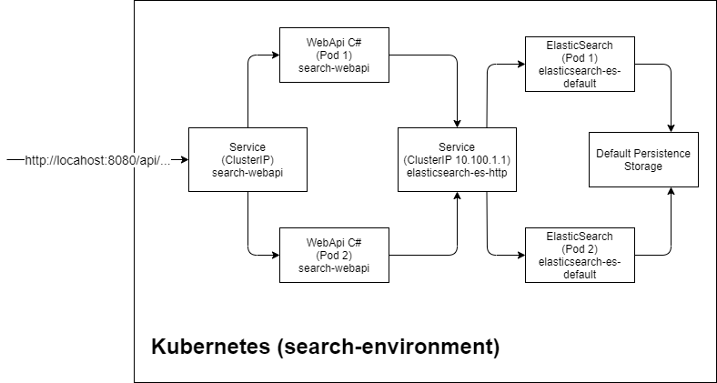

### Microservice-Search

##### Setting up using Kind

Delete cluster if already running
```console
kind delete cluster
```

Create cluster and mocked docker registry called localhost:5000 (Use Git Bash on Windows)

```console
./kind-local-registry.sh
```

Apply namespace for the ``search-environment``

```console
kubectl apply -f namespace.yaml
```

Install the ElasticCloudKubernetes (See: https://www.elastic.co/guide/en/cloud-on-k8s/master/k8s-deploy-eck.html
)

```console
kubectl apply -f https://download.elastic.co/downloads/eck/1.3.0/all-in-one.yaml
```

Apply the ElasticSearchCloudCluster settings for the ``search-environment``


```console
kubectl apply -f elasticsearch.yaml
```

Build the C# WebApi 

```console
cd webapi/BookStoreSearch
docker build -f BookStoreSearch/Dockerfile -t localhost:5000/search-webapi:1.4 .
```

Push the created C# WebApi Docker image into the mocked docker registry called localhost:5000  

```console
docker push localhost:5000/search-webapi:1.4
```

Go back to the folder microservice-search

```console
cd .. 
cd ..
```

Apply the webapi settings for the ``search-environment``

```console
kubectl apply -f webapi.yaml
```

Check if everything is working
```console
kubectl get all --namespace search-environment
```

```console
NAME                                 READY   STATUS    RESTARTS   AGE
pod/elasticsearch-es-default-0       1/1     Running   0          2m33s
pod/search-webapi-85459966d6-pz4r2   1/1     Running   0          2m10s

NAME                                 TYPE        CLUSTER-IP       EXTERNAL-IP   PORT(S)    AGE
service/elasticsearch-es-default     ClusterIP   None             <none>        9200/TCP   2m33s
service/elasticsearch-es-http        ClusterIP   10.100.1.1       <none>        9200/TCP   2m34s
service/elasticsearch-es-transport   ClusterIP   None             <none>        9300/TCP   2m34s
service/search-webapi                ClusterIP   10.107.156.168   <none>        80/TCP     2m10s

NAME                            READY   UP-TO-DATE   AVAILABLE   AGE
deployment.apps/search-webapi   1/1     1            1           2m10s

NAME                                       DESIRED   CURRENT   READY   AGE
replicaset.apps/search-webapi-85459966d6   1         1         1       2m10s

NAME                                        READY   AGE
statefulset.apps/elasticsearch-es-default   1/1     2m33s
```


##### Accessing the WebApi

Eventually, this service works like that:



Port forwarding for testing

```console
kubectl port-forward service/search-webapi 8080:80 --namespace search-environment
```

Adding mock content

```console
POST http://127.0.0.1:8080/api/books
{
  "Name" : "Harry Potter and the Philosopher's Stone",
  "Description" : "Harry Potter and the Philosopher's Stone is a fantasy novel written by British author J. K. Rowling. The first novel in the Harry Potter series and Rowling's debut novel, it follows Harry Potter, a young wizard who discovers his magical heritage on his eleventh birthday, when he receives a letter of acceptance to Hogwarts School of Witchcraft and Wizardry.",
  "Author" : "J. K. Rowling"
}
```

```console
POST http://127.0.0.1:8080/api/books
{
  "Name" : "The Last Wish",
  "Description" : "The Last Wish (Polish: Ostatnie życzenie) is the first (in its fictional chronology; published second in original Polish) of the two collections of short stories (the other being Sword of Destiny) preceding the main Witcher Saga, written by Polish fantasy writer Andrzej Sapkowski.",
  "Author" : "Andrzej Sapkowski"
}
```

```console
POST http://127.0.0.1:8080/api/books
{
  "Name" : "Clean Code",
  "Description" : "A Handbook of Agile Software Craftsmanship",
  "Author" : "Robert C. Martin"
}
```

```console
201 - Created
```

Sending search requests

```console
GET http://127.0.0.1:8080/api/search?query=Witcher
```

```console
200 - OK
[
    {
        "id": "83a6b90b-d38b-4bac-96a5-56caadc9e814",
        "name": "The Last Wish",
        "description": "The Last Wish (Polish: Ostatnie ?yczenie) is the first (in its fictional chronology; published second in original Polish) of the two collections of short stories (the other being Sword of Destiny) preceding the main Witcher Saga, written by Polish fantasy writer Andrzej Sapkowski.",
        "author": "Andrzej Sapkowski"
    }
]
```


